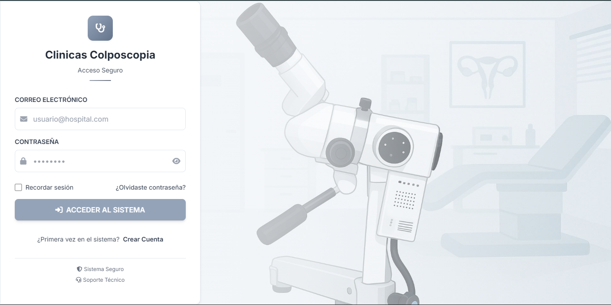
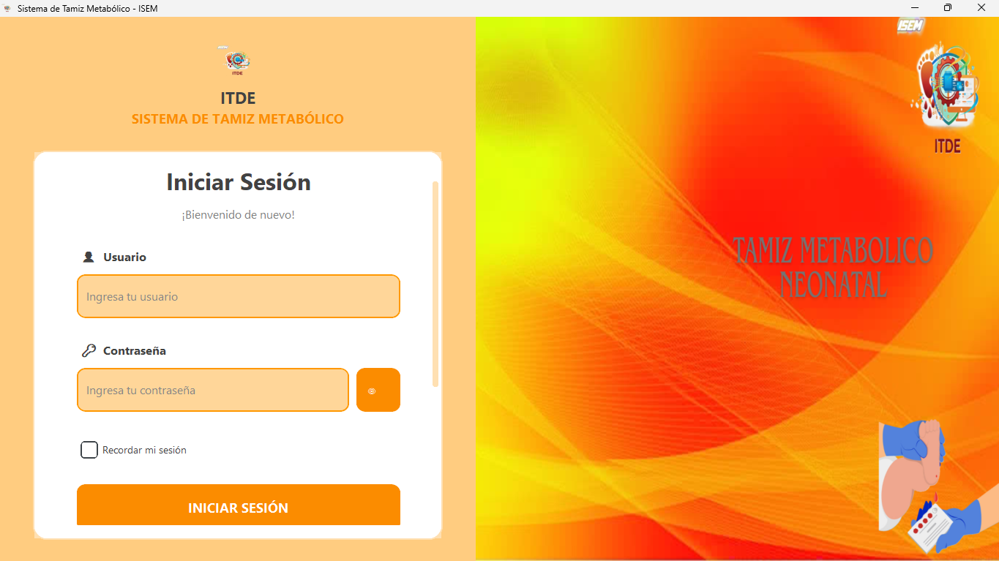

<div align="center">

<!-- BANNER -->


<!-- TYPING -->
<a href="https://github.com/AlejandroPGDev">
  
</a>

<br/><br/>

<!-- CONTACTO -->
<a href="mailto:ap736g@gmail.com"></a>
&nbsp;
<a href="https://www.linkedin.com/in/AlejandroPGDev"></a>
&nbsp;


<br/><br/>

</div>

<br/>

<!-- ══════════════════════════ SOBRE MÍ ══════════════════════════ -->
<h2 align="center">Sobre Mí</h2>

<div align="center">


```json
{
  "nombre": "Alejandro Pérez",
  "titulacion": "Ingeniero en Sistemas",
  "rol": "Backend Developer",
  "stack_principal": [
    "PHP",
    "MySQL",
    "APIs REST"
  ],
  "otras_herramientas": [
    "PostgreSQL",
    "SQL Server",
    "JavaScript"
  ]
}
```


</div>

Ingeniero en Sistemas recién egresado. Lo mío es el backend con **PHP** — me dedico a construir sistemas web, diseñar APIs REST y estructurar bases de datos que funcionen bien.

Manejo **MySQL**, **PostgreSQL** y **SQL Server** en el día a día, y uso **JavaScript** para conectar todo con el frontend cuando toca. Me gusta que el código quede limpio, que la base de datos tenga sentido y que las cosas funcionen como deben.

<br/>
<div align="center">
  
</div>
<br/>

<!-- ══════════════════════════ STACK TECNOLÓGICO ══════════════════════════ -->
<h2 align="center">Tecnologías</h2>

<br/>

<div align="center">

<!-- BACKEND -->

<br/><br/>
<a href="#"></a>
<br/><br/>


<br/><br/>

<!-- BASES DE DATOS -->

<br/><br/>
<a href="#"></a>
&nbsp;

<br/><br/>

<!-- FRONTEND -->

<br/><br/>
<a href="#"></a>
<br/><br/>

<!-- OTROS LENGUAJES -->

<br/><br/>
<a href="#"></a>
<br/><br/>

<!-- HERRAMIENTAS -->

<br/><br/>
<a href="#"></a>

</div>

<br/>
<div align="center">
  
</div>
<br/>

<!-- ══════════════════════════ PROYECTOS PROFESIONALES ══════════════════════════ -->
<h2 align="center">Proyectos Profesionales</h2>

<br/>

<!-- PROYECTO 1: SISTEMA CLINICAS -->
<div align="center">
<table width="85%" style="border-collapse: collapse; border: 1px solid #30363d; border-radius: 8px;">
<tr>
  <td align="center" style="padding: 0;">
    
  </td>
</tr>
<tr>
  <td align="left" style="padding: 25px;">
    <h3> Sistema para Clínicas de Colposcopía</h3>
    
    <br/><br/>
    <p>
      Sistema web completo para el manejo de expedientes en clínicas de colposcopía del ISEM. Captura y valida datos clínicos, lleva el control de pacientes y genera reportes institucionales con gráficos estadísticos de forma automática.
    </p>
    <b>Características principales:</b>
    <ul>
      <li>Registro y validación de expedientes en tiempo real.</li>
      <li>Generación automática de reportes PDF.</li>
      <li>Gráficos dinámicos para indicadores médicos.</li>
      <li>API REST para comunicación entre módulos.</li>
    </ul>
    <br/>
    
    
    
    
  </td>
</tr>
</table>
</div>

<br/>

<!-- PROYECTO 2: ITDE -->
<div align="center">
<table width="85%" style="border-collapse: collapse; border: 1px solid #30363d; border-radius: 8px;">
<tr>
  <td align="center" style="padding: 0;">
    
  </td>
</tr>
<tr>
  <td align="left" style="padding: 25px;">
    <h3> ITDE — Automatización de Reportes</h3>
    
    <br/><br/>
    <p>
      Herramienta de escritorio que automatiza la extracción y transformación de datos desde SQL Server. Genera archivos Excel con gráficos integrados listos para presentar, ahorrándole al equipo varias horas de trabajo manual cada semana.
    </p>
    <b>Características principales:</b>
    <ul>
      <li>Consultas masivas automatizadas a SQL Server.</li>
      <li>Transformación y limpieza de datos con Pandas.</li>
      <li>Generación de reportes Excel (.xlsx) con gráficos.</li>
      <li>Reducción del tiempo operativo a minutos.</li>
    </ul>
    <br/>
    
    
    
    
  </td>
</tr>
</table>
</div>

<br/>
<div align="center">
  
</div>
<br/>

<!-- ══════════════════════════ MÉTRICAS Y ACTIVIDAD ══════════════════════════ -->
<h2 align="center">Actividad en GitHub</h2>

<br/>

<div align="center">


<br/><br/>


</div>

<br/>

<!-- FOOTER -->
